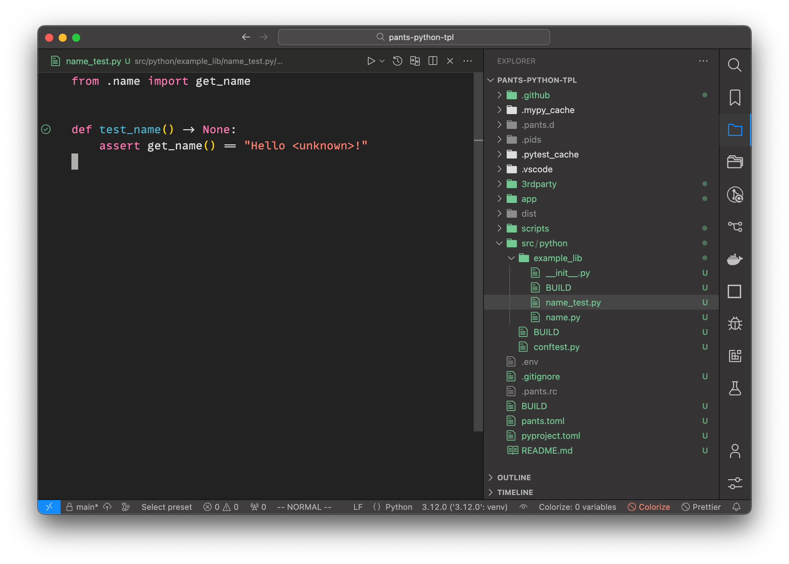
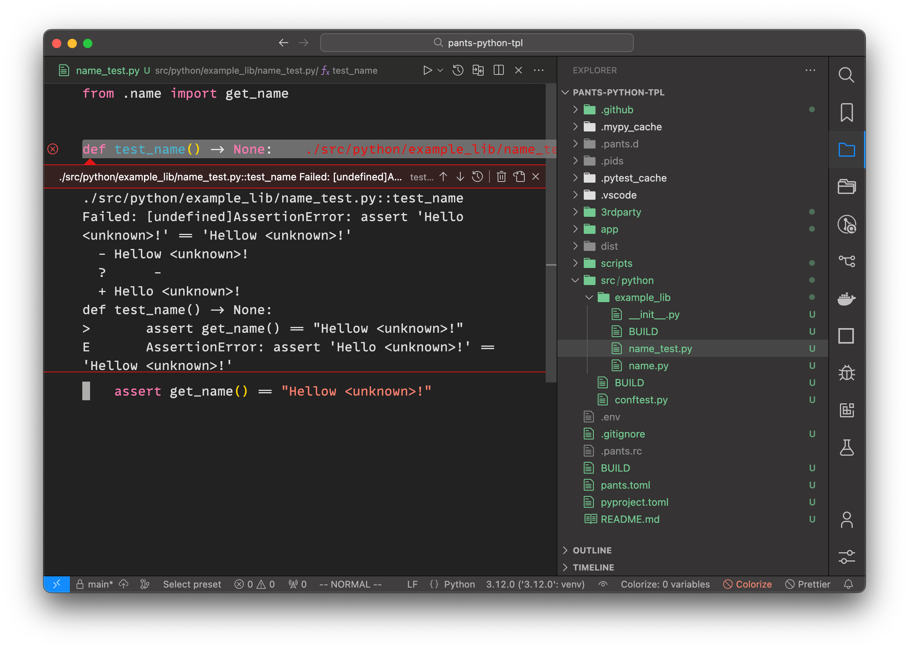
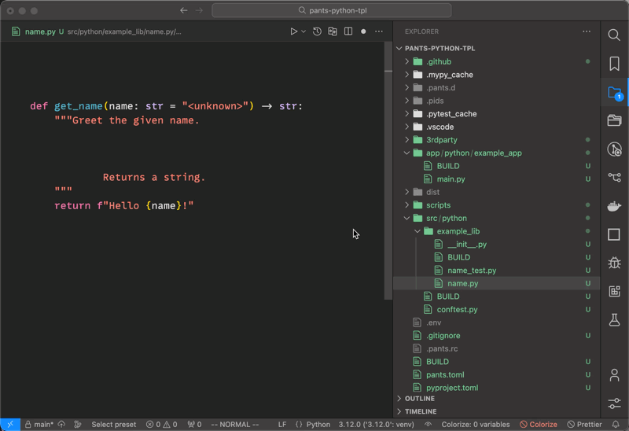
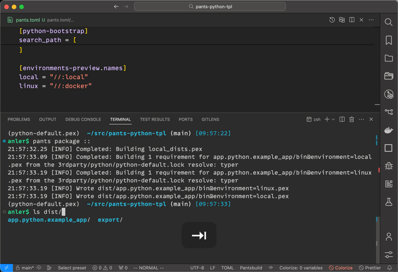

# Template for Python projects using Pants 👖

See [Pants](https://pantsbuild.org).

Features:

- Python 3.12
- Black
- Docformatter
- Ruff
- Mypy
- IPdb
- Pytest + Faker
- Cross-platform build environments (local and Linux using Docker)

## VSCode support

There's a script for generating VSCode settings: `./scripts/gen-vscode-settings.sh`

## Screenshots

